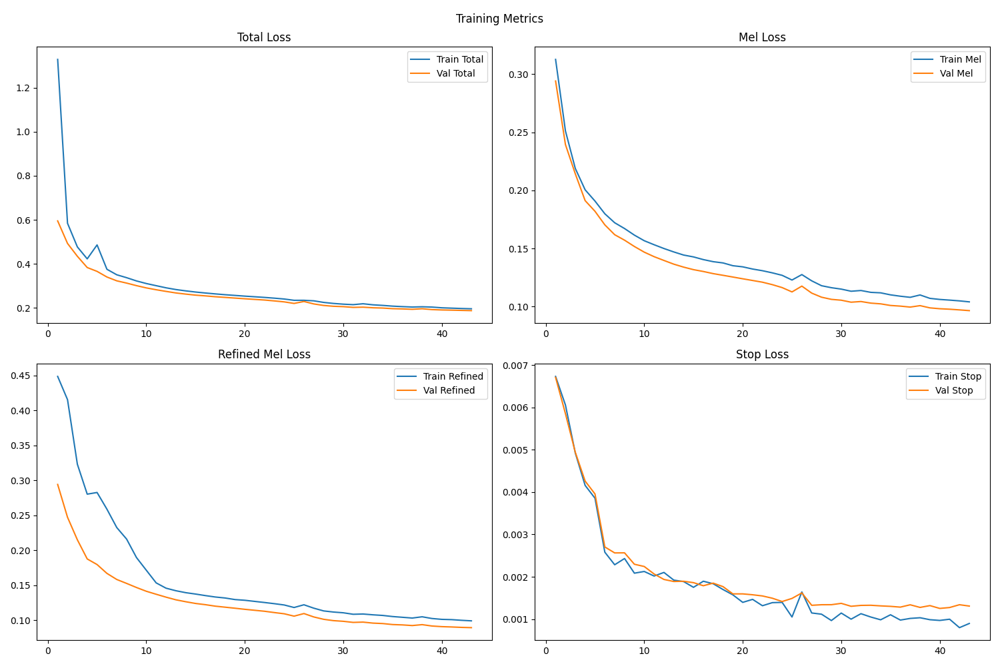

# Text-to-Speech with Tacotron 2

This project implements a Text-to-Speech (TTS) system using the Tacotron 2 architecture. It provides a complete pipeline for data preparation, training, and checking training results.

## Prerequisites

-   Linux OS (recommended)
-   [Anaconda](https://www.anaconda.com/products/distribution) or Miniconda installed
-   Python 3.8+

## Installation

1.  **Clone the repository:**

    ```bash
    git clone <repository_url>
    cd Text-to-Speech-with-Tacotron-2
    ```

2.  **Create and activate a Conda environment:**

    ```bash
    conda create -n tts_env python=3.10 -y
    conda activate tts_env
    ```

3.  **Install dependencies:**

    ```bash
    pip install -r requirements.txt
    ```

## Data Preparation

1.  **Download the LJSpeech-1.1 dataset:**

    The project uses the LJSpeech-1.1 dataset. You can download and extract it using the following commands:

    ```bash
    wget https://data.keithito.com/data/speech/LJSpeech-1.1.tar.bz2
    tar -xjf LJSpeech-1.1.tar.bz2
    ```

    Ensure the `LJSpeech-1.1` directory is in the root of the project.

2.  **Create Train/Test Split:**

    Run the `split.py` script to generate `train.csv` and `test.csv` in the `data/` directory.

    ```bash
    python -m tts.data_prep.split --dataset_dir LJSpeech-1.1 --save_dir data
    ```

    **Arguments:**
    -   `--dataset_dir`: Path to the LJSpeech dataset directory (e.g., `LJSpeech-1.1`).
    -   `--save_dir`: Directory to save the split CSV files (default suggestion: `data`).
    -   `--test_size`: Proportion of dataset for testing (default: 0.1).
    -   `--random_state`: Random seed (default: 42).
    -   `--sort`: Sort by duration (optional).

## Training

To start the training pipeline, run the `train.py` module. This script handles the training loop, validation, and checkpointing.

```bash
python -m tts.pipeline.train
```

The training script will:
-   Load data from `data/train.csv` and `data/test.csv`.
-   Save checkpoints to `checkpoints/`.
-   Save generated audio samples to `generated_audio/`.
-   Log progress to `training.log`.

## Results

During and after training, you can visualize the training losses and metrics.

### Training Losses

Below is a visualization of the training metrics including Total Loss, Mel Loss, Refined Mel Loss, and Stop Loss.



Generated plots are also saved as `training_losses.html` for interactive viewing.
